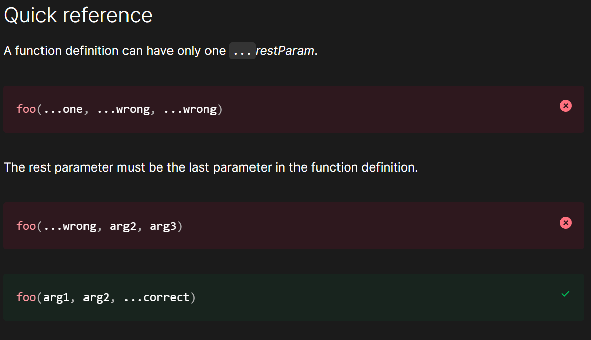

# Rest Parameter or Rest Operator

- The rest parameter syntax allows a function to accept an indefinite number of arguments as an array.

- Example 1: 

        function sum(...theArgs) {
            let total = 0;
            for (const arg of theArgs) {
                total += arg;
            }
            return total;
        }

        console.log(sum(1, 2, 3));
        console.log(sum(1, 2, 3, 4));

- A function definition's last parameter can be prefixed with (...) which will cause all remaining parameters to be placed within a standard JavaScript array. Only the last parameter in a function definition can be a rest parameter.

- Example 2:

        function myFun(a, b, ...manyMoreArgs) {
            console.log("a", a);
            console.log("b", b);
            console.log("manyMoreArgs", manyMoreArgs);
        }

        myFun("one", "two", "three", "four", "five", "six");

# Note

