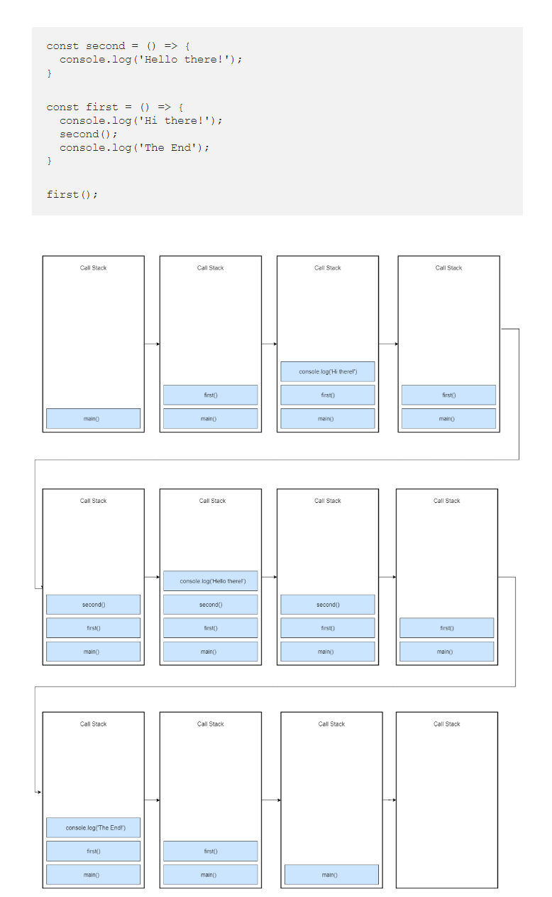

# What is single thread ?

    Single threaded processes contain the execution of instructions in a single sequence. In other words, one command/statement is processes at a time.

# JS is single threaded, how can JS handle asyncronous process

    - JavaScript is single threaded which means that only one statement is executed at a time.

    - Single threaded means it only has one call stack (LIFO)

    - The call stack as its name implies is a stack with a LIFO (Last in, First out) structure.
    
    - It is used to store all the execution context created during the code execution

# What is synchronous programming ?

    - synchrounous (or sync) programming is the program which executes line by line, one line at a time.

    - whenever a function is called, the program waits until the function return before continue executing the next line.

# How synchronous work in call stack ?

# How JS handle asynchronous process 

## What is asynchronous programming ?

    - In async programming the program doesn’t wait for the task to complete and can move on to the next task.

    - Imagine requesting some data from an API. Depending upon the situation the server might take some time to process the request while blocking the main thread making the web page unresponsive.

    - That’s where asynchronous JavaScript comes into play. 

    - Using asynchronous JavaScript (such as callbacks, promises, and async/await), you can perform long network requests without blocking the main thread

## What is main thread ?

    - The main thread is where a browser processes user events and paints. 
    
    - By default, the browser uses a single thread to run all the JavaScript in your page, as well as to perform layout, reflows, and garbage collection. 
    
    - This means that long-running JavaScript functions can block the thread, leading to an unresponsive page and a bad user experience

## Example: 

### Why this happened ?

    - Call stack job as we seen earlier is to check what instruction is at the top of the stack and execute it. 
    
    - If there is an instruction like setTimeout() that requires extra time to execute then call stack will pop that out and send it to Web API.

    - In Javascript, All instructions are put on a call stack. When the stack arrives at setTimeout, the engine sees it as a Web API instruction and pops it out and sends it to Web API. 
    
    - Once the Web API is done with the execution, it will arrive at the call back queue.

## Note: setTimeout is not a part of the JavaScript engine, it’s a part of something known as web APIs (in browsers) and C/C++ APIs (in node.js)

## What is Web API ?

    - Web API as the name suggests, is an API over the web which can be accessed using HTTP (Hypertext Transfer Protocol).

    - HTTP is the foundation of data communication for the World Wide Web, where hypertext documents include hyperlinks to other resources that the user can easily access, for example by a mouse click or by tapping the screen in a web browser

# Conclusion

    - Javascript engine (V8, Spidermonkey, JavaScriptCore, etc...), which has Web API that handle these tasks in the background

## Example on non-web API: